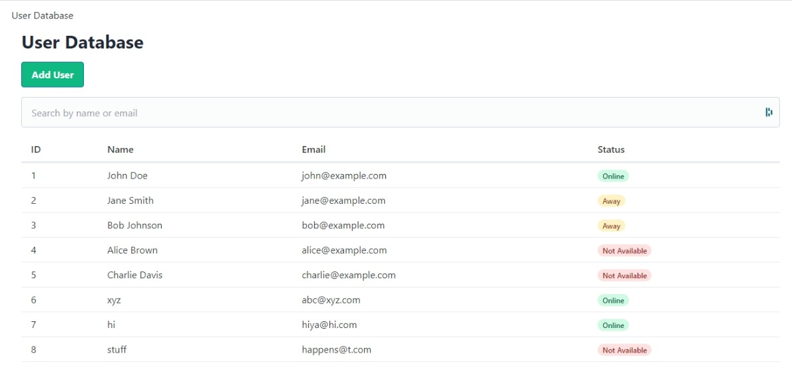
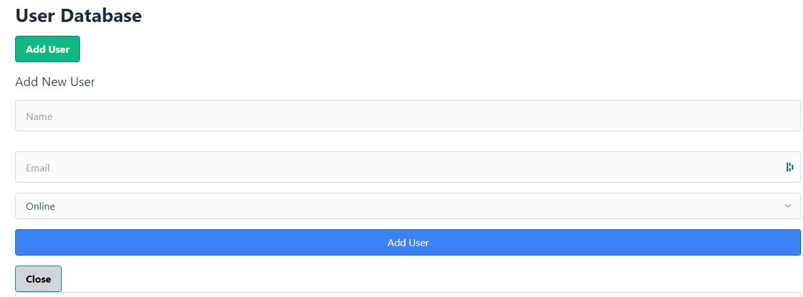

# FastHTML based app generated by claude sonnet

## Goal 

Create a simple app to display users in a database



On clicking the Add button it shows a modal dialog to add a new user to the database and display it


### Installation

```shell
pip install -r requirements.txt
```

### Run App

First create the database using

```shell
python create_database.py
```

Run the app with
```shell
python app.py
```